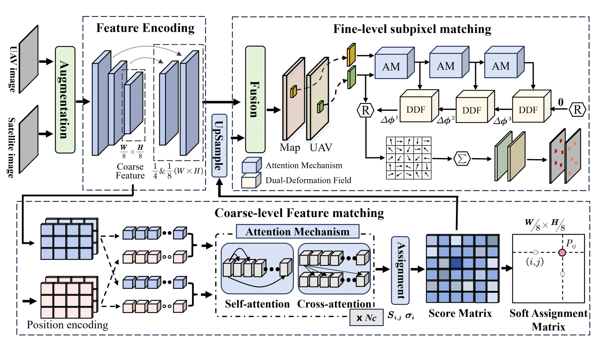

# M3T-UAV: Vision-Based UAV Geolocalization in Multi-Modal, Multi-Scene and Multi-Temporal Scenarios

This repository provides the **M3T-UAV dataset** and the **LoFTDF** framework for UAV visual geolocalization under multi-modal, multi-scene, and multi-temporal conditions.

## Overview

Reliable UAV geolocation is critical for autonomous navigation in GNSS-denied or spoofed environments. Existing vision-based methods are often limited by single-modality data, small-scale benchmarks, and weak generalization across scene and temporal variations.

To address these challenges, this project combines:

- **M3T-UAV Dataset**: a large-scale, strictly aligned triplet dataset (`UAV visible / UAV infrared / satellite map`) with diverse scenes and temporal gaps.
- **LoFTDF Framework**: a semi-dense matching model with redesigned coarse assignment and dual-deformation field (DDF) based fine alignment.
- **Evaluation Protocols**: localization-oriented metrics including GeoAUC@T and VPS.



*The proposed LoFTDF architecture.*

## Performance Highlights

LoFTDF reports strong performance on M3T-UAV:

- **Visible -> Satellite**: VPS = **0.9036**
- **Infrared -> Satellite**: VPS = **0.4421**

## M3T-UAV Dataset

For detailed M3T-UAV dataset documentation, see `data/m3t/README_m3t.md`.

## Training and Testing Pipeline

The recommended workflow is:

- Step 1: pre-train on **M3T**
- Step 2: fine-tune on **MegaDepth**
- Step 3: evaluate on **M3T test set** for both `uav_vis -> map` and `uav_ir -> map`

Quick commands:

```bash
python train.py --stage pretrain
python train.py --stage finetune
python test.py configs/data/m3t_test.py configs/loftdf/test.py --ckpt_path 
```

Recommended scripts:

```bash
bash scripts/reproduce_train/pretrain_m3t.sh
bash scripts/reproduce_train/finetune_megadepth.sh
bash scripts/reproduce_test/test_m3t.sh
```

## M3T-UAV Dataset Notes

M3T-UAV is organized into training and testing splits, with modality-specific folders (`uav_vis`, `uav_ir`, `map`) and merged annotation files (`vis.json`, `ir.json`). The annotations include image paths, geometric transformation matrices, and localization-related metadata.

The dataset is intended for research on:

- UAV-to-satellite matching
- cross-modal geometric registration
- robust geolocalization under scene and temporal changes

## Resources

- Paper: *M3T-UAV: Vision-Based UAV Geolocalization in Multi-Modal, Multi-Scene and Multi-Temporal Scenarios*
- Code repository: [GitHub Repository](https://github.com/JinHaiXu0322/M3T-UAV)
- Dataset path in this repo: `data/m3t/`

## License

This dataset and codebase are for academic research use. For commercial use, please contact the authors.
This project is heavily built upon LoFTR.
