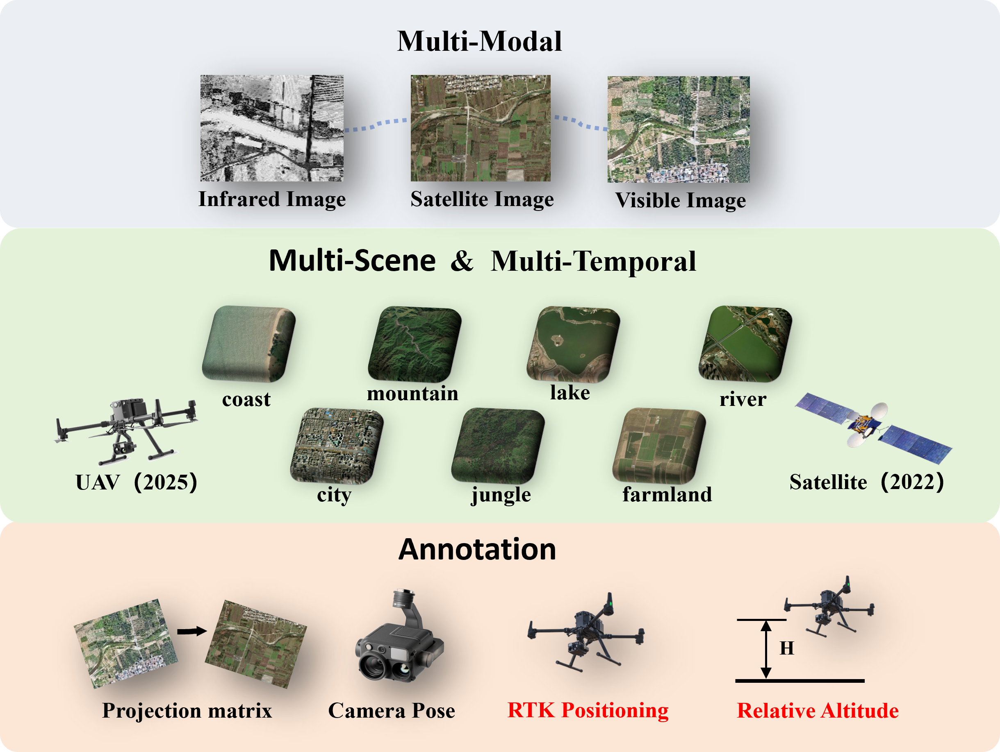

# M3T-UAV: Vision-Based UAV Geolocalization in Multi-Modal, Multi-Scene and Multi-Temporal Scenarios

This repository provides the **M3T-UAV dataset**, introduced in the paper *"M3T-UAV: Vision-Based UAV Geolocalization in Multi-Modal, Multi-Scene and Multi-Temporal Scenarios"*. 

M3T-UAV is the first large-scale dataset specifically designed for UAV visual geolocalization under **multi-modal, multi-scene, and multi-temporal conditions**. It contains over **29,000 densely sampled and strictly registered triplets** of UAV visible images, infrared images, and satellite maps. The dataset covers **seven representative scene attributes** (city, mountain, jungle, river, lake, farmland, and coast), enabling comprehensive evaluation across diverse environments. Moreover, UAV images and satellite imagery are collected at different time periods (e.g., 2025 vs. 2022), introducing realistic **temporal variations** such as structural and environmental changes. 

The present release includes the complete testing split and a partial training split. The full codebase and the complete dataset will be made publicly available after formal publication.



*Overview of the M3T-UAV dataset. It includes three modalities, seven scene categories, and two temporal domains. Red annotations indicate labels that are only available in the test dataset.*


## Overview

- **Training set**: 28 sequences in the complete version, covering 7 scene attributes: `city`, `mountain`, `lake`, `jungle`, `coast`, `river`, and `farmland`.
- **Testing set**: 6 sequences, also covering the same 7 scene attributes.

## Repository Structure

```text
M3T-UAV/
├── train_dataset/
│   ├── 001/
│   ├── 002/
│   ├── ...
│   ├── 006/
│   ├── ...
│   ├── 028/
│   ├── ir.json
│   └── vis.json
├── test_dataset/
│   ├── test01/
│   ├── test02/
│   ├── test03/
│   ├── test04/
│   ├── test05/
│   ├── test06/
│   ├── ir.json
│   └── vis.json
└── README.md
```

At the sequence level, each folder contains UAV image data and corresponding satellite map tiles. In the current organization:

- `uav_ir/`: infrared UAV images.
- `uav_vis/`: visible-spectrum UAV images.
- `map/`: satellite remote sensing imagery.

The root-level annotation files `ir.json` and `vis.json` store merged annotations for infrared and visible UAV imagery, respectively.


## Dataset Download

The current dataset release can be downloaded via Baidu Netdisk:

- **Baidu Netdisk**: [https://pan.baidu.com/s/1_8aw2ZQ8Xg24V29aBnwV3w?pwd=shpn]


## Annotation Contents

### Training Set

The training set contains the following core fields:

- `uav_img_path`: relative paths to UAV images within a sequence.
- `map_path`: relative paths to satellite map tiles.
- `pose`: `yaw`, `pitch`, and `roll` are defined under the NED coordinate system and are expressed in degrees.
- `H_matrix`: the projection matrix from UAV image space to map space.

### Testing Set

The testing set contains all fields included in the training set, together with additional evaluation-oriented annotations:

- `Geo_gt`: UAV RTK-based geographic ground-truth positions with centimeter-level accuracy.
- `relative_alt`: depth-related elevation information of the UAV image with respect to the ground surface.
- `attributes`: multi-label scene annotations designed to better capture the compositional nature of real-world environments.

## Field Definitions

- **UAV imagery**: UAV observations are provided in both infrared and visible modalities, enabling cross-modal and modality-specific evaluation.
- **Satellite map**: the map imagery is north-south aligned remote sensing imagery.
- **Pose**: `yaw`, `pitch`, and `roll` under the NED.
- **Homography / projection matrix**: `H_matrix` denotes the geometric projection from the UAV image to the corresponding map plane.
- **Attributes**: scene semantics are annotated using a multi-label strategy rather than a single-label taxonomy.

## Intended Use

This dataset is intended for research on:

- UAV-to-satellite image matching,
- geometric registration between airborne and overhead imagery,
- multimodal localization with infrared and visible UAV observations,
- robust localization across diverse scene attributes.

## Remarks

If you use this repository in academic research, please cite the corresponding paper once the publication information becomes available.

## License

This dataset is released for academic research purposes only. For commercial use, please contact the authors.
